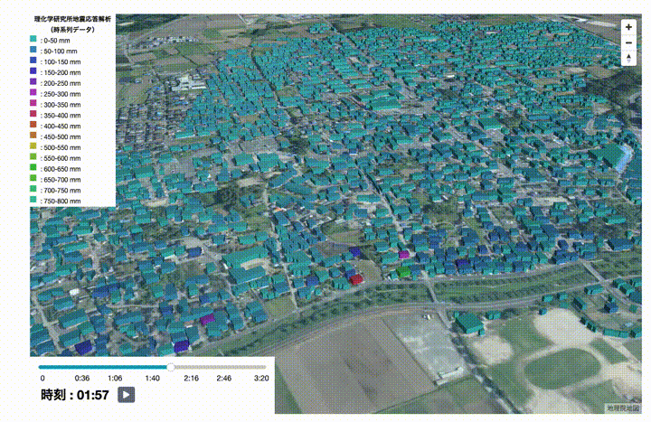
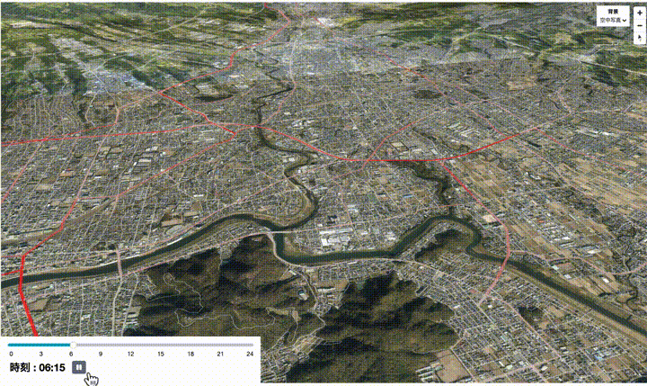
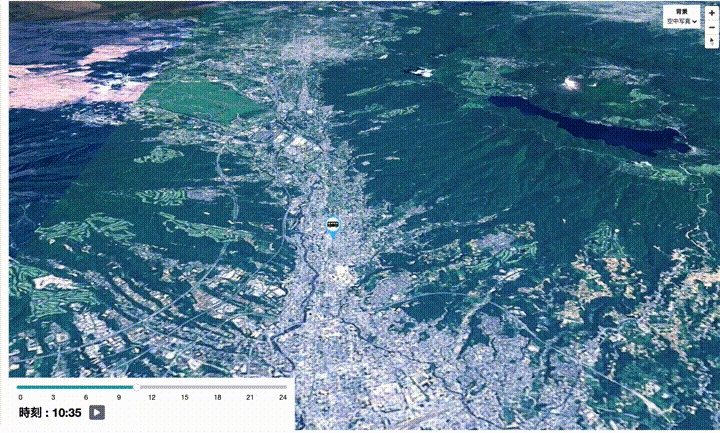

# timeline_data_spec

simple-geo-viewer上で時系列データを表示させる場合のオリジナルデータ、設定ファイルの仕様

## 時系列データ掲載のための変換仕様

simple-geo-viewer上で時系列データを表示させる場合のオリジナルデータ、設定ファイルの仕様

- リポジトリ
    - https://github.com/aigidjp/timeline-data-spec
- 表示対象リポジトリ
    - https://github.com/aigidjp/simple-geo-viewer

### 表示可能な時系列データの種別

- 設定ファイルは2パターンに分かれる
    - **時間間隔が等分で、属性が変化するデータ**
        - 地物を固定で時間に応じて色を変化させたい場合
    - **時間間隔が等分で位置が変化するデータ**
        - 時間に応じて地物自体が移動するようなデータ
- 時間間隔が等分ではない場合は、データを補間するなどして時間間隔を等分にする必要がある

### 表示イメージ

- **時間間隔が等分で、属性が変化するデータ**
- これは特定の地域全体での大規模地震の直後数秒間における、個別建物の振動シミュレーションの時系列変位をアニメーション化したものです



- これは東京大学空間情報科学研究センターの擬似人流データを道路リンクに時間帯別通行量の形で付与し、アニメーション化したものです



- **時間間隔が等分で位置が変化するデータ**
- これはバスの時刻表データ（GTFSデータ）をベースに個別バスの1日の動きをアニメーション化したものです



### 表示設定ファイル仕様

- simple-geo-viewerで読み取り可能なmenu.jsonの仕様を示す
- 時系列データの表示に関わる項目は以下である
    - timeScale: 時間間隔（hour/minute/second/frame）
      - 1frameは1/60秒として取り扱う
    - interval: 一つの要素が表している単位時間
      - 小数点は取り扱わず、整数で指定する
    - start: 要素の0番目の値が示している時刻
    - end: 要素の最後の値が示している時刻

```json
{
  "category": "時間間隔が等分で、属性が変化するデータ",
  "open": false,
  "url": "https://...",
  "data": [
    {
      "title": "サンプルの時系列データ",
      "type": "polygon",
      "lng": 130.817427,
      "lat": 32.790219,
      "zoom": 14,
      "id": [
        "xxx"
      ],
      "checked": true,
      "color": "#333333",
      "timeScale": "hour",
      "interval": 1,
      "start": "00:00",
      "end": "24:00"
    }
  ]
}
```

- 時系列データのスケールが24時間ではない時は以下のように設定し、擬似的に時刻を割り当てる

```json
{
  "category": "時間間隔が等分で、属性が変化するデータ",
  ...
  "data": [
    {
      ...
      "timeScale": "second",
      "interval": 1,
      "start": "00:00",
      "end": "00:12"
    }
  ]
}
```

- 時系列データのスケールが1/10秒など1秒未満の場合は、以下のようにframeを設定する
  - 以下の設定は6/60frame、つまり0.1秒間隔で12秒間（合計120個）のデータを表示することを示す

```json
{
  "category": "時間間隔が等分で、属性が変化するデータ",
  ...
  "data": [
    {
      ...
      "timeScale": "frame",
      "interval": 6,
      "start": "00:00",
      "end": "00:12"
    }
  ]
}
```

### オリジナルデータに必要な情報

- **時間間隔が等分で、属性が変化するデータ**
    - GeoJSONの形式であることが必須
    - 時系列データが格納されているカラムが必須
        - 対象カラムは複数あってはならない
        - `1, 10, 2, 5…`のようなカンマ区切り文字列である必要がある

    ```json
    {
      "type": "Feature",
      "properties": {
        "sample_data": [
          1.219, 1.151, 1.006, 0.852, 0.785, 0.853, 1.017, 1.213, 1.403, 1.576,
          1.739, 1.898, 2.047, 2.158, 2.199, 2.146, 1.987, 1.734, 1.405, 1.015,
          0.593, 0.193, 0.235, 0.52, 0.727, 0.852, 0.895, 0.853, 0.746, 0.628
        ]
      },
      "geometry": {
        "type": "MultiPolygon",
        "coordinates": [
          [
            [
              [130.80725075, 32.78355098],
              [130.80721128, 32.78353378],
              [130.80718665, 32.78357342],
              [130.80722504, 32.78359062],
              [130.80725075, 32.78355098]
            ]
          ]
        ]
      }
    }
    ```

    - それ以外のカラムは全て自由

- **時間間隔が等分で位置が変化するデータ**
    - JSON形式であることが必須
        - （GeoJSONではない）
    - point（経緯度）のみに対応
    - 要素は属性と時間間隔に応じた経緯度が複数格納されている

    ```json
    [
      {
        "properties": { "id": "サンプル" },
        "segments": [
          [138.860228, 35.102139, 1],
          [138.85886, 35.101779, 2],
          [138.857654, 35.102198, 3],
          [138.857894, 35.103495, 4],
          [138.85856, 35.104462, 5],
          [138.859716, 35.103914, 6],
          [138.858278, 35.105388, 7],
          [138.858541, 35.10713, 8]
        ]
      },
      ...
    ]
    ```
  
    - それ以外のカラムは全て自由